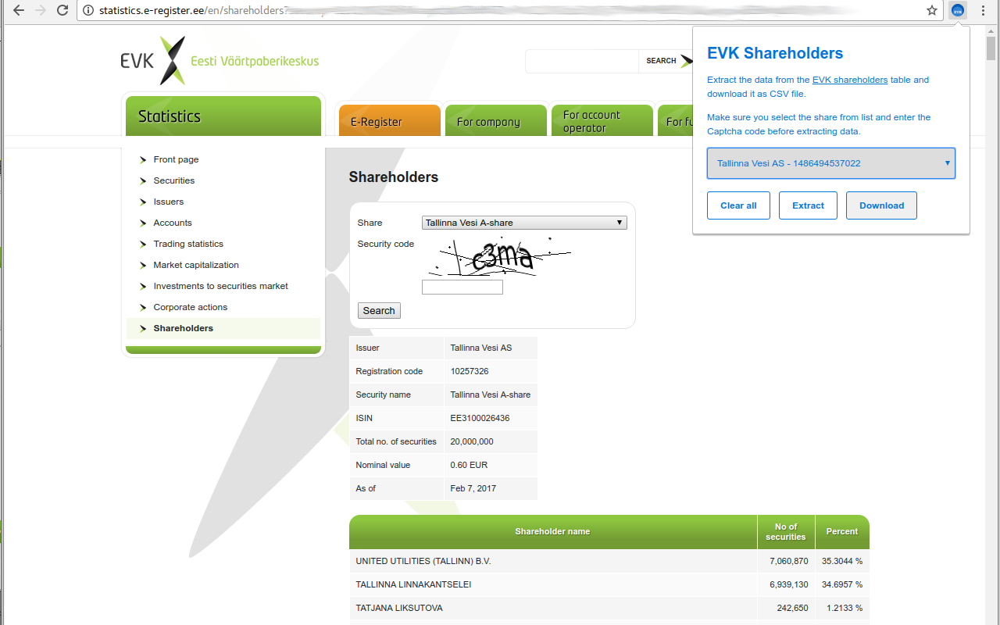

# Chrome extension to extract EVK Shareholders data

Extract the data from the [EVK shareholders](http://statistics.e-register.ee/en/shareholders) table and download it as CSV file. No external API requests are made, the data is extracted from
the currently open webpage.

## Backlog

  - Download all the extracted data as a zip file.
  - Compare the same share between different days, show the diff as a chart.

## Install

Get it from Google Web store or use the source version by loading the extension from (chrome://extensions)[chrome://extensions/]

## License

MIT
